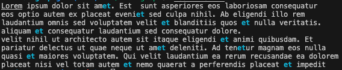

# fast-grep

[GNU grep](https://www.gnu.org/software/grep/) is a command line tool for
finding matching text patterns. GNU grep can operate on shell input or file
input, and is particularly useful for highlighting matching text patterns within
a large body of text.

fast-grep re-implements GNU grep using Go's built in concurrency.

## Goals

- Get more familiar with concurrency in Golang.
- Make a faster grep tool.

## Building

```shell
go build
```

## Testing

### Run unit tests

```shell
go test -v ./...
```

### Run benchmark tests

```shell
go test -v ./... -bench=. -run=xxx -benchmem
```

## Usage

```text
fast-grep search_pattern file_path [flags]
```

## Flags

```text
--config string   config file (default is $HOME/.fast-grep.yaml)
-h, --help            help for fast-grep
-t, --toggle          Help message for toggle
-v, --version         version for fast-grep
```

## Example

```shell
./fast-grep et test-file.txt
```

### Result


